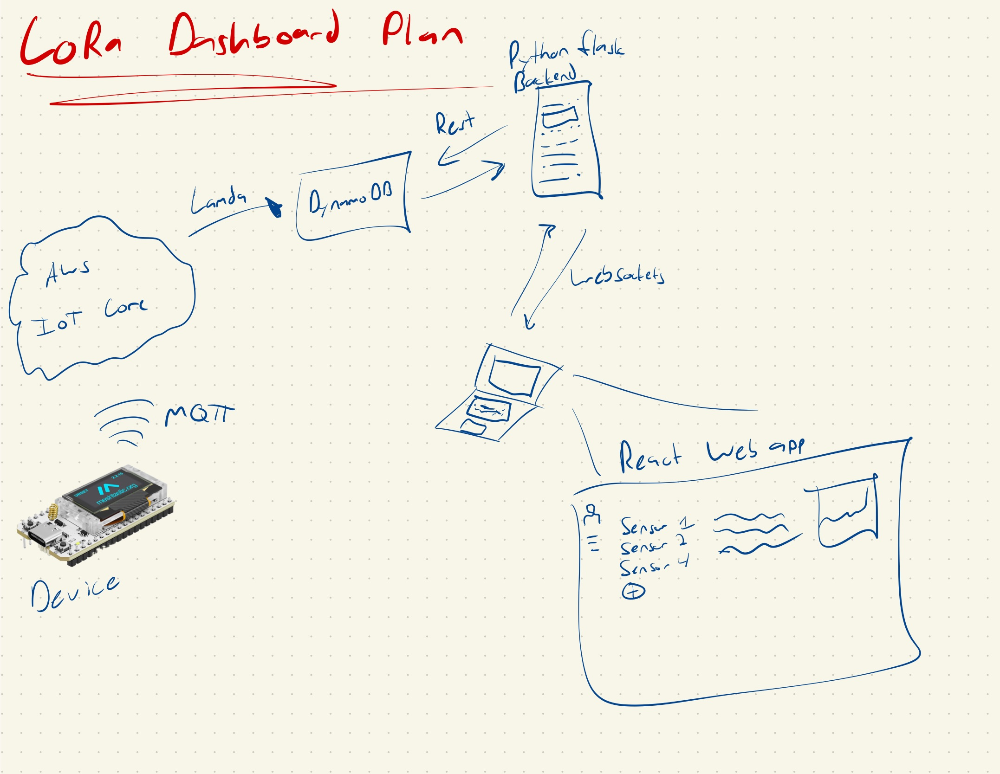

# LoRa-Dashboard

Use LoRa compatible Esp32's to send sensor data through AWS IoT core to a React Front-end. Utalize REST, WebSockets and AWS IoT Core to allow remote sensing devices to send data to a React Web App.

- [ ] [Device](docs/device.md): MakerFocus ESP32 LoRa v3 Development Board
- [ ] [Firmware](docs/firmware.md): C++ IoT sensor
- [ ] [AWS IoT Core/DynamoDB](docs/cloud.md)
- [ ] [Backend](docs/backend.md): REST, WebSockets
- [ ] [Frontend](docs/frontend.md): React JS

## Block Diagram

